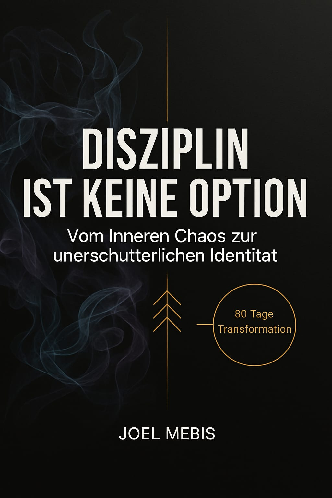

# Hi, ich bin Joel Mebis 👋
## aktuell lerne ich und bin Teilnehmer eines 12- monatigen Fullstack Software Developer Bootcamps bei neue fische
## Aktuell lerne ich
- HTML & CSS
- JavaScript
- React
- Node.js
- Datenbanken
- Git & Github
## Meine Interessen & Hobys 🚀
- Webentwicklung
- Digitale Produkte entwickeln
- Schreiben & kreatives Arbeiten
## 📖 Mein Buchprojekt

🚀 Digitale Produkte zu erstrellen bedeutet für mich, Probleme zu erkennen und Lösungen zu bauen, die echten Mehrwert schaffen.
## Mein Ziel
Als Fullstack Developer innovative und nutzerfreundliche Anwendungen entwickeln-und gleichzeitig kreative Projekte wie mein Buch vorranzubringen.
## übergeordnetes Ziel
Ich arbeite mit voller Motivation und Disziplin daran, meinen 12-monatigen Kurs erfolgreich abzuschließen und mein Zertifikat mit Stolz in den Händen zu halten.

<!--
**joelmebis/joelmebis** is a ✨ _special_ ✨ repository because its `README.md` (this file) appears on your GitHub profile.

Here are some ideas to get you started:

- 🔭 I’m currently working on ...
- 🌱 I’m currently learning ...
- 👯 I’m looking to collaborate on ...
- 🤔 I’m looking for help with ...
- 💬 Ask me about ...
- 📫 How to reach me: ...
- 😄 Pronouns: ...
- ⚡ Fun fact: ...
-->
